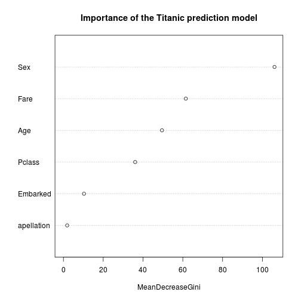

Prediction of the people´s fate who traveled on the Titanic 
========================================================
## Introduction
The goal is to create a program to predict the fate of people who traveled in Titanic. Many persons died in the Titanic, the program tries to predict whether a person survives or not based on the information of such person. The program is created from historical information about people who survived and others who died on the Titanic.

The program is created to participate in a [kaggle competition](https://www.kaggle.com/c/titanic-gettingStarted) and is part of the course "Introduction to Data Science" ([Coursera](https://www.coursera.org/course/datasci)). The final score obtained in the kaggle is 0.77033

The language used to create the program is R. The prediction models are made with the random forest method.

The next sections are:
- Overview of data: In this part, the train dataset are analyzed, cleaned, and processed
- First program: The prediction model is created and the first version of the program is build.
- Second prediction model: The prediction model is changed
- Third prediction model: The prediction model is again changed
- Fourth prediction model: The final version of the prediction model is explained
- Conclusions: The results of the program are described.

## Overview of data
General visualization of training dataset

```r
library(bitops)
library(RCurl)
dt_train <- read.csv(text = getURL("https://raw.githubusercontent.com/jesusmoranbarbon/Titanic-kaggle/master/Data/train.csv"), header = TRUE, stringsAsFactors = FALSE)
head(dt_train)
```

```
  PassengerId Survived Pclass
1           1        0      3
2           2        1      1
3           3        1      3
4           4        1      1
5           5        0      3
6           6        0      3
                                                 Name    Sex Age SibSp
1                             Braund, Mr. Owen Harris   male  22     1
2 Cumings, Mrs. John Bradley (Florence Briggs Thayer) female  38     1
3                              Heikkinen, Miss. Laina female  26     0
4        Futrelle, Mrs. Jacques Heath (Lily May Peel) female  35     1
5                            Allen, Mr. William Henry   male  35     0
6                                    Moran, Mr. James   male  NA     0
  Parch           Ticket   Fare Cabin Embarked
1     0        A/5 21171  7.250              S
2     0         PC 17599 71.283   C85        C
3     0 STON/O2. 3101282  7.925              S
4     0           113803 53.100  C123        S
5     0           373450  8.050              S
6     0           330877  8.458              Q
```

The training dataset is composed of:
- **PassengerId**: Identificator, is not important to the prediction model
- **Survived**: Boolean that represent wether a person survived (1) or not (0)
  
  Distribution of persons:
  
  ```r
  table(dt_train$Survived, exclude = NULL)
  ```
  
  ```
  
     0    1 <NA> 
   549  342    0 
  ```
  
  This information is transformed in factor type:
  
  ```r
  dt_train$Survived <- as.factor(dt_train$Survived)
  ```
- **Pclass**: Socio-economic status. There are three possible values: 1 (high), 2 (medium) or 3 (low)
  
  Distribution of persons:
  
  ```r
  table(dt_train$Pclass, exclude = NULL)
  ```
  
  ```
  
     1    2    3 <NA> 
   216  184  491    0 
  ```
  
  In this training dataset there is not missing values, but in others it is possible , for these reason the missing values are replaced by the class with more people:
  
  ```r
  largerClass <- max(dt_train$Pclass, na.rm = TRUE)
  dt_train$Pclass[is.na(dt_train$Pclass)] <- largerClass
  dt_train$Pclass <- as.factor(dt_train$Pclass)
  ```
- **Name**: Name of the persons. In this field there are other field inside. All persons has a title, for example mr., dr., sir., etc. A new field named "apellation" is created with this information. The possible values are:
  - "common" with the titles: mr, master, ms, miss, mrs, mlle and mme
  - "important" with the titles: don, dr, rev, major, col, sir, lady, the countess and jonkheer
  - "captain" with the title capt
  - "other" for the rest of titles
  
  For these reasons:
  
  ```r
  dt_train$apellation <- NA 
  dt_train$apellation[grepl("mr\\.|master\\.|ms\\.|miss\\.|mrs\\    .|mlle\\.|mme\\.", tolower(dt_train$Name))] <- "common"
  dt_train$apellation[grepl("capt\\.", tolower(dt_train$Name))] <- "captain"
  dt_train$apellation[grepl("don\\.|dr\\.|rev\\.|major\\.|col\\.|sir\\.|lady\\.|the countess\\.|jonkheer\\.", tolower(dt_train$Name))] <- "important"
  dt_train$apellation <- as.factor(dt_train$apellation)
  ```
- **Sex**: There are two possible values: male or female
  
  Distribution of persons:
  
  ```r
  table(dt_train$Sex, exclude = NULL)
  ```
  
  ```
  
  female   male   <NA> 
     314    577      0 
  ```
  
  In this training dataset there is not missing values, but in others it is possible , for these reason the missing values are replaced by the class with more people:
  
  ```r
  largerSex <- max(dt_train$Sex, na.rm = TRUE)
  dt_train$Sex[is.na(dt_train$Sex)] <- largerSex
  dt_train$Sex <- as.factor(dt_train$Sex)
  ```
- **Age**: A numeric that represent the age.

  Distribution of persons:
  
  ```r
  table(dt_train$Age, exclude = NULL)
  ```
  
  ```
  
  0.42 0.67 0.75 0.83 0.92    1    2    3    4    5    6    7    8    9   10 
     1    1    2    2    1    7   10    6   10    4    3    3    4    8    2 
    11   12   13   14 14.5   15   16   17   18   19   20 20.5   21   22   23 
     4    1    2    6    1    5   17   13   26   25   15    1   24   27   15 
  23.5   24 24.5   25   26   27   28 28.5   29   30 30.5   31   32 32.5   33 
     1   30    1   23   18   18   25    2   20   25    2   17   18    2   15 
    34 34.5   35   36 36.5   37   38   39   40 40.5   41   42   43   44   45 
    15    1   18   22    1    6   11   14   13    2    6   13    5    9   12 
  45.5   46   47   48   49   50   51   52   53   54   55 55.5   56   57   58 
     2    3    9    9    6   10    7    6    1    8    2    1    4    2    5 
    59   60   61   62   63   64   65   66   70 70.5   71   74   80 <NA> 
     2    4    3    4    2    2    3    1    2    1    2    1    1  177 
  ```
  
  ```r
  hist(dt_train$Age, xlab = "Age", main = "Histogram of Age in the training dataset")
  ```
  
   
  
  There are 177 values with missing values, for these reasons these missing values are replaced with the mean age.
  
  ```r
  meanAge <- mean(dt_train$Age, na.rm = TRUE)
  dt_train$Age[is.na(dt_train$Age)] <- meanAge
  ```
- **Sibsp**: Number of siblings/spouses aboard. Distribution of persons:
  
  ```r
  table(dt_train$SibSp, exclude = NULL)
  ```
  
  ```
  
     0    1    2    3    4    5    8 <NA> 
   608  209   28   16   18    5    7    0 
  ```
  
  In this training dataset there is not missing values, but in others it is possible , for these reason the missing values are replaced by the class with more people:
  
  ```r
  largerSibSp <- as.numeric(names(which.max(table(dt_train$SibSp))))
  dt_train$SibSp[is.na(dt_train$SibSp)] <- largerSibSp
  ```
- **Parch**: Number of parents/children aboard. Distribution of persons:
  
  ```r
  table(dt_train$Parch, exclude = NULL)
  ```
  
  ```
  
     0    1    2    3    4    5    6 <NA> 
   678  118   80    5    4    5    1    0 
  ```
  
  In this training dataset there is not missing values, but in others it is possible , for these reason the missing values are replaced by the class with more people:
  
  ```r
  largerParch <- as.numeric(names(which.max(table(dt_train$Parch))))
  dt_train$Parch[is.na(dt_train$Parch)] <- largerParch
  ```
- **Ticket**: Number of tickets. Some tickets have letter, but in general does not seem important.
- **Fare**:  In this training dataset there is not missing values, but in others it is possible , for these reason the missing values are replaced by the mean fare:
  
  ```r
  meanFare <- mean(dt_train$Fare, na.rm = TRUE)
  dt_train$Fare[is.na(dt_train$Fare)] <- meanFare
  ```
- **Cabin**: Distribution of persons:
  
  ```r
  table(dt_train$Cabin, exclude = NULL)
  ```
  
  ```
  
                              A10             A14             A16 
              687               1               1               1 
              A19             A20             A23             A24 
                1               1               1               1 
              A26             A31             A32             A34 
                1               1               1               1 
              A36              A5              A6              A7 
                1               1               1               1 
             B101            B102             B18             B19 
                1               1               2               1 
              B20             B22             B28              B3 
                2               2               2               1 
              B30             B35             B37             B38 
                1               2               1               1 
              B39              B4             B41             B42 
                1               1               1               1 
              B49              B5             B50     B51 B53 B55 
                2               2               1               2 
  B57 B59 B63 B66         B58 B60             B69             B71 
                2               2               1               1 
              B73             B77             B78             B79 
                1               2               1               1 
              B80         B82 B84             B86             B94 
                1               1               1               1 
          B96 B98            C101            C103            C104 
                4               1               1               1 
             C106            C110            C111            C118 
                1               1               1               1 
             C123            C124            C125            C126 
                2               2               2               2 
             C128            C148              C2         C22 C26 
                1               1               2               3 
      C23 C25 C27             C30             C32             C45 
                4               1               1               1 
              C46             C47             C49             C50 
                1               1               1               1 
              C52             C54         C62 C64             C65 
                2               1               1               2 
              C68              C7             C70             C78 
                2               1               1               2 
              C82             C83             C85             C86 
                1               2               1               1 
              C87             C90             C91             C92 
                1               1               1               2 
              C93             C95             C99               D 
                2               1               1               3 
          D10 D12             D11             D15             D17 
                1               1               1               2 
              D19             D20             D21             D26 
                1               2               1               2 
              D28             D30             D33             D35 
                1               1               2               2 
              D36             D37             D45             D46 
                2               1               1               1 
              D47             D48             D49             D50 
                1               1               1               1 
              D56              D6              D7              D9 
                1               1               1               1 
              E10            E101             E12            E121 
                1               3               1               2 
              E17             E24             E25             E31 
                1               2               2               1 
              E33             E34             E36             E38 
                2               1               1               1 
              E40             E44             E46             E49 
                1               2               1               1 
              E50             E58             E63             E67 
                1               1               1               2 
              E68             E77              E8              F2 
                1               1               2               3 
              F33             F38              F4           F E69 
                3               1               2               1 
            F G63           F G73              G6               T 
                1               2               4               1 
             <NA> 
                0 
  ```
  
  In this training dataset there are more persons who has not assigned Cabin. For these reasons there are analyzed the relation between a person who has (or not) assigned Cabin and if this person survived (or not). Then a new fiel is created, hasCabin:
  
  ```r
  dt_train$hasCabin <- FALSE
  dt_train$hasCabin[!(dt_train$Cabin == "")] <- TRUE
  dt_train$hasCabin <- as.factor(dt_train$hasCabin)
  table(dt_train$Survived, dt_train$hasCabin)
  ```
  
  ```
     
      FALSE TRUE
    0   481   68
    1   206  136
  ```
  
  With this information it seems that if a person has a Cabin is more likely to survive, and if one persons has not a Cabin is more likely not survive.
  
- **Embarked**:  Port of embarkation. There are three possibilities:  C (Cherbourg), Q (Queenstown), S (Southampton).
  
  Distribution of persons:
  
  ```r
  table(dt_train$Embarked, exclude = NULL)
  ```
  
  ```
  
          C    Q    S <NA> 
     2  168   77  644    0 
  ```
  
  In this training dataset there is not missing values, but in others it is possible , for these reason the missing values are replaced by the class with more people:
  
  ```r
  maxEmbarked <- max(dt_train$Embarked)
  dt_train$Embarked[dt_train$Embarked == ""] <- maxEmbarked
  dt_train$Embarked <- as.factor(dt_train$Embarked)
  ```

## First program
With the above analysis a program is created. This program is composed of four functions:
- munging(dt): The information is cleaned and transformed. In the process, two new fields are created (apellation and hasCabin) as discussed in the previous section.
- buildModel(dt): A prediction random forest model based on the training dataset is created.
- predictSurvived(model, dt, sol): A prediction is realized and then the result is saved in suitable format with the "sol" name.
- Main(): The driver of the program. In this proyect a model is created (with the functions munging and buildModel) and then a prediction of test dataset is realized (with the function predictSurvived).

Code: (the code are explained in the sections "Overview of data" and "First program")

```r
munging <- function(dt){
  largerClass <- max(dt$Pclass, na.rm = TRUE)
  dt$Pclass[is.na(dt$Pclass)] <- largerClass
  dt$Pclass <- as.factor(dt$Pclass)
  dt$apellation <- "other" 
  dt$apellation[grepl("mr\\.|master\\.|ms\\.|miss\\.|mrs\\.|mlle\\.|mme\\.", tolower(dt$Name))] <- "common"
  dt$apellation[grepl("capt\\.", tolower(dt$Name))] <- "captain"
  dt$apellation[grepl("don\\.|dr\\.|rev\\.|major\\.|col\\.|sir\\.|lady\\.|the countess\\.|jonkheer\\.", tolower(dt$Name))] <- "important"
  dt$apellation <- as.factor(dt$apellation)
  my_levels <- c("captain", "common", "important", "other")
  levels(dt$apellation) <- c(levels(dt$apellation), my_levels[!(my_levels %in% levels(dt$apellation))])
  largerSex <- max(dt$Sex, na.rm = TRUE)
  dt$Sex[is.na(dt$Sex)] <- largerSex
  dt$Sex <- as.factor(dt$Sex)
  meanAge <- mean(dt$Age, na.rm = TRUE)
  dt$Age[is.na(dt$Age)] <- meanAge
  largerSibSp <- as.numeric(names(which.max(table(dt$SibSp))))
  dt$SibSp[is.na(dt$SibSp)] <- largerSibSp
  largerParch <- as.numeric(names(which.max(table(dt$Parch))))
  dt$Parch[is.na(dt$Parch)] <- largerParch
  meanFare <- mean(dt$Fare, na.rm = TRUE)
  dt$Fare[is.na(dt$Fare)] <- meanFare
  dt$hasCabin <- FALSE
  dt$hasCabin[!(dt$Cabin == "")] <- TRUE
  dt$hasCabin <- as.factor(dt$hasCabin)
  maxEmbarked <- max(dt$Embarked)
  dt$Embarked[dt$Embarked == ""] <- maxEmbarked
  dt$Embarked <- as.factor(dt$Embarked)
  
  if ("Survived" %in% names(dt)){
    dt$Survived <- as.factor(dt$Survived)
  }
  
  return (dt)
}


buildModel <- function(dt){
  library(randomForest)
  fit <- randomForest(Survived ~ Pclass + Sex + Age + SibSp + Parch + Fare + Embarked + apellation + hasCabin, data = dt)
  return (fit)
}


predictSurvived <- function(model, dt, sol){
  Prediction <- predict(model, dt)
  submit <- data.frame(PassengerId = dt$PassengerId, Survived = as.numeric(as.character(Prediction)))
  write.csv(submit, file = paste("../Data/", sol, sep=""), row.names = FALSE)
}


Main <- function(){
  library(bitops)
  library(RCurl)
  dt_train <- read.csv(text = getURL("https://raw.githubusercontent.com/jesusmoranbarbon/Titanic-kaggle/master/Data/train.csv"), header = TRUE, stringsAsFactors = FALSE)
  dt_train <- munging(dt_train)
  
  fit <- buildModel(dt_train)
  
  dt_test <- read.csv(text = getURL("https://raw.githubusercontent.com/jesusmoranbarbon/Titanic-kaggle/master/Data/test.csv"), header = TRUE, stringsAsFactors = FALSE)
  dt_test <- munging(dt_test)
  
  predictSurvived(fit, dt_test, "submit_solution_1.csv")
}

Main()
```

The prediction is in [Github](https://github.com/jesusmoranbarbon/Titanic-kaggle/blob/master/Data/submit_solution_1.csv).

With this model, the result in the Kaggle competition is **0.7512**

</img>

## Second prediction model
To improve the prediction, a second model is created without the field hasCabin. This field contains "True" if the person has anything in the field Cabin or "False" in other cases. 


```r
buildModel_2 <- function(dt){
  library(randomForest)
  fit <- randomForest(Survived ~ Pclass + Sex + Age + SibSp + Parch + Fare + Embarked + apellation, data = dt)
  return (fit)
}

Main_2 <- function(){
  library(bitops)
  library(RCurl)
  dt_train <- read.csv(text = getURL("https://raw.githubusercontent.com/jesusmoranbarbon/Titanic-kaggle/master/Data/train.csv"), header = TRUE, stringsAsFactors = FALSE)
  dt_train <- munging(dt_train)
  
  fit <- buildModel_2(dt_train)
  
  dt_test <- read.csv(text = getURL("https://raw.githubusercontent.com/jesusmoranbarbon/Titanic-kaggle/master/Data/test.csv"), header = TRUE, stringsAsFactors = FALSE)
  dt_test <- munging(dt_test)
  
  predictSurvived(fit, dt_test, "submit_solution_2.csv")
}

Main_2()
```

The prediction is in [Github](https://github.com/jesusmoranbarbon/Titanic-kaggle/blob/master/Data/submit_solution_2.csv).

With this model, the result in the Kaggle competition is **0.75598**

</img>

## Third prediction model
A third model is created without the field Parch. This field is not relevant.

```r
table(dt_train$Survived, dt_train$Parch)
```

```
   
      0   1   2   3   4   5   6
  0 445  53  40   2   4   4   1
  1 233  65  40   3   0   1   0
```


```r
buildModel_3 <- function(dt){
  library(randomForest)
  fit <- randomForest(Survived ~ Pclass + Sex + Age + SibSp  + Fare + Embarked + apellation, data = dt)
  return (fit)
}

Main_3 <- function(){
  library(bitops)
  library(RCurl)
  dt_train <- read.csv(text = getURL("https://raw.githubusercontent.com/jesusmoranbarbon/Titanic-kaggle/master/Data/train.csv"), header = TRUE, stringsAsFactors = FALSE)
  dt_train <- munging(dt_train)
  
  fit <- buildModel_3(dt_train)
  
  dt_test <- read.csv(text = getURL("https://raw.githubusercontent.com/jesusmoranbarbon/Titanic-kaggle/master/Data/test.csv"), header = TRUE, stringsAsFactors = FALSE)
  dt_test <- munging(dt_test)
  
  predictSurvived(fit, dt_test, "submit_solution_3.csv")
}

Main_3()
```

The prediction is in [Github](https://github.com/jesusmoranbarbon/Titanic-kaggle/blob/master/Data/submit_solution_3.csv).

With this model, the result in the Kaggle competition is **0.76555**

</img>

## Fourth prediction model
The third model is improved by the creation of a new random forest model without the field SibSp. This field is not relevant.

```r
table(dt_train$Survived, dt_train$SibSp)
```

```
   
      0   1   2   3   4   5   8
  0 398  97  15  12  15   5   7
  1 210 112  13   4   3   0   0
```


```r
buildModel_4 <- function(dt){
  library(randomForest)
  fit <- randomForest(Survived ~ Pclass + Sex + Age  + Fare + Embarked + apellation, data = dt)
  return (fit)
}

Main_4 <- function(){
  library(bitops)
  library(RCurl)
  dt_train <- read.csv(text = getURL("https://raw.githubusercontent.com/jesusmoranbarbon/Titanic-kaggle/master/Data/train.csv"), header = TRUE, stringsAsFactors = FALSE)
  dt_train <- munging(dt_train)
  
  fit <- buildModel_4(dt_train)
  
  dt_test <- read.csv(text = getURL("https://raw.githubusercontent.com/jesusmoranbarbon/Titanic-kaggle/master/Data/test.csv"), header = TRUE, stringsAsFactors = FALSE)
  dt_test <- munging(dt_test)
  
  predictSurvived(fit, dt_test, "submit_solution_4.csv")
}

Main_4()
```

The prediction is in [Github](https://github.com/jesusmoranbarbon/Titanic-kaggle/blob/master/Data/submit_solution_4.csv).

The importance of the fields in the model:

```r
library(bitops)
library(RCurl)
dt_train <- read.csv(text = getURL("https://raw.githubusercontent.com/jesusmoranbarbon/Titanic-kaggle/master/Data/train.csv"), header = TRUE, stringsAsFactors = FALSE)
dt_train <- munging(dt_train)
 
fit <- buildModel_4(dt_train)

varImpPlot(fit, main = "Importance of the Titanic prediction model")
```

 

With this model, the result in the Kaggle competition is **0.77033**

</img>

## Conclusions
A program to predict the fate of persons in Titanic is developed. This program is presented in a Kaggle competition and obtains 0.77033 of score. This result is not enough good, but this result for the first Kaggle competition is nice.

The program consist in a prediction model (random forest) and, with this model, the program predict if one person survived in the Titanic accident or not.

This program can be improved, for example the importance of the field Age can be analysed. A important amount of the Age rows are replaced with the average, and this substitution introduces incorrectness in the model.
